# 第1天：安装Anaconda+Python 3.10+VS Code
## 实训目标
能在本地运行一个Python hello world脚本。

## 操作过程
1. 访问Anaconda官网下载安装包：https://www.anaconda.com/products/distribution#download-section
2. 安装关键设置：务必勾选「Add Anaconda to my PATH environment variable」，不勾选会导致普通终端无法识别conda命令。
3. 创建3.10虚拟环境、激活环境
```bash
conda create-n py310 python=3.10
conda activate py310
```
4. 安装VS Code并配置Python插件；新建py文件打印Hello World，终端正常运行。
## 运行截图
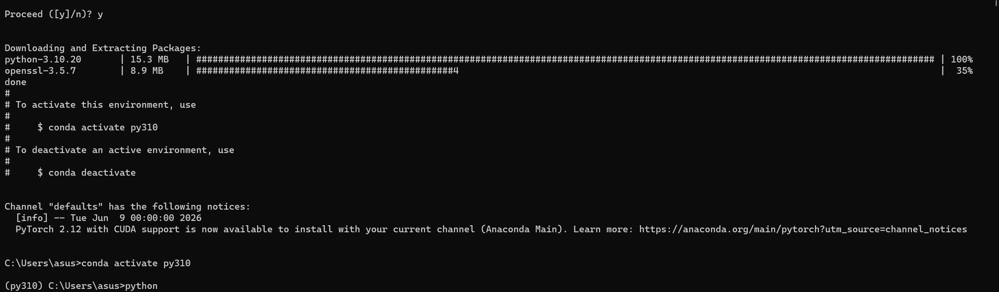
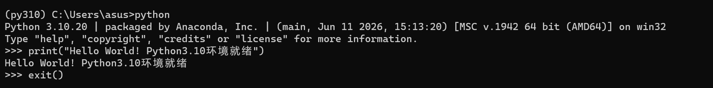

## 遇到问题
最初安装路径包含中文，Anaconda弹窗报错。
## 解决方法
更换D盘纯英文路径后解决。

# 第2天：安装PyTorch（CPU版）
## 实训目标
在Python交互环境中执行 import torch 无报错，成功查看PyTorch版本。

## 操作过程
1. 配置pip全局清华镜像源，提升包下载速度，终端执行：
```bash
pip config set global.index-url https://pypi.tuna.tsinghua.edu.cn/simple
```
2. 提前激活 py310 虚拟环境，安装CPU版PyTorch：
```bash
pip3 install torch torchvision torchaudio --index-url https://download.pytorch.org/whl/cpu
```
3. 进入python交互界面导入torch，查看版本号。
## 运行截图
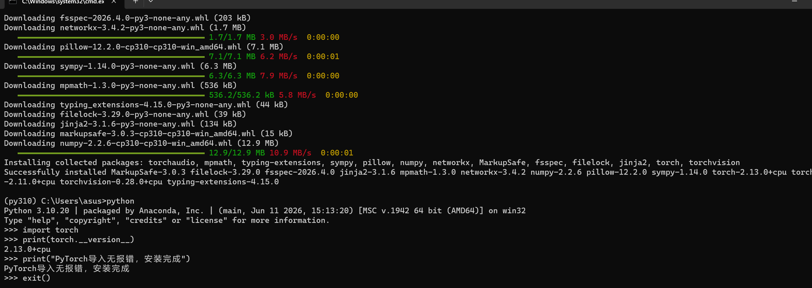
## 遇到问题：
pip下载速度太慢，安装中断；
新开普通CMD无法识别conda命令；
误将Python代码直接输入命令行，提示不是内部命令。
## 解决方法：
使用国内清华镜像源加速安装；
改用Anaconda Prompt专用终端解决；
需先输入python进入>>>交互界面再执行代码。

# 第3天：注册GitHub+安装Git，掌握基础仓库操作
## 实训目标
在GitHub平台创建空白远程仓库，本地通过git clone拉取仓库，完成至少一次完整的commit本地提交+push云端推送流程。

## 操作过程
1. Git官网地址：https://git-scm.com/download/win
2. 开启Watt Toolkit加速工具，官网：https://steampp.net/
3. 打开Git Bash终端，配置全局用户名与绑定邮箱
```bash
# 设置GitHub昵称
git config --global user.name "你的GitHub用户名"
# 设置注册GitHub时使用的邮箱
git config --global user.email "xxx@xxx.com"
# 校验全局配置是否生效
git config --global --list
```
4. GitHub 网页端创建空白仓库：主页右上角点击加号按钮 → 选择 New repository 新建仓库，
我的测试仓库地址：https://github.com/qzx51725172/git-test.git
5. 仓库完整操作流程逻辑：Git 全局配置 → 克隆远程仓库至本地 → 新建文件 → add 暂存变更 → commit 本地生成版本快照 → push 同步至 GitHub 远程
6. 分步执行完整 Git 指令：
```bash
# 将云端仓库完整克隆到本地，自动绑定本地与远程仓库关联
git clone https://github.com/qzx51725172/git-test.git
# 在本地仓库目录生成测试代码文件（仅本地可见，云端无同步）
echo "xxx" > test.py
# 将新增文件加入Git暂存区，标记待提交变更
git add test.py
# 在本地生成版本快照，填写提交备注记录本次修改
git commit -m "初次提交，新增test.py测试文件"
# 将本地未同步的版本快照完整推送至GitHub远程仓库
git push origin main
```
clone到本地的原理：每次commit都会保存完整修改快照，所有历史版本永久存在服务器和本地，随时可以查看、回退旧代码。（思路：Git全局配置→克隆空仓库→创建文件→add暂存→commit本地提交→push推送GitHub）

## 运行截图
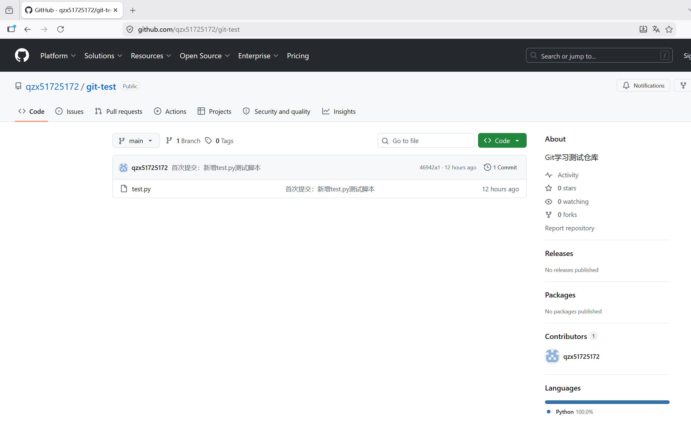
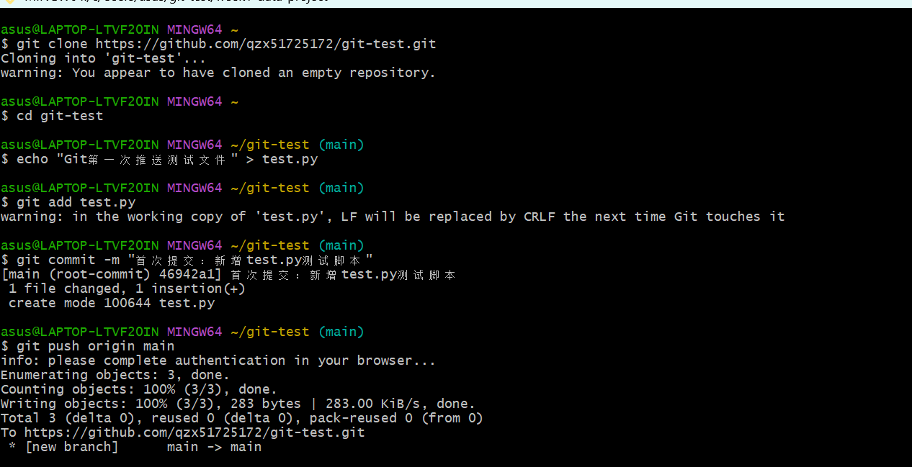
## 遇到问题
GitHub 网页无法正常打开、加载。
## 解决方法
后台运行 Watt Toolkit 工具，开启 GitHub 网络加速后，网页可正常访问与操作。

# 第4天：国内合规平替 Google Colab 免费 GPU 运行
## 实训目标
使用百度飞桨 AI Studio：新建 Notebook、切换免费 GPU 算力，运行代码打印 GPU 硬件信息，验证显卡可用。

## 操作过程
1. 飞桨 AI Studio 官网aistudio.baidu.com。
2. 点击右上角「创建项目」，项目名称填写Day4-GPU测试实验，Notebook 版本选择BML Codelab（唯一支持免费 GPU 的版本），IDE 默认 JupyterLab，其余配置留空，点击创建。
3. 进入项目 Notebook 页面，右上角初始硬件标识为 CPU，点击 CPU 按钮弹出「切换环境」面板；免费资源分类下选择V100 32GB免费 GPU 实例，点击确定重启算力环境，等待加载完成。
4. 页面底部点击「代码」新建代码单元格，先尝试 PyTorch 检测代码，环境无 torch 库导入报错；更换飞桨原生 Paddle 代码，执行 GPU 硬件检测。
5. 代码正常运行，成功输出 CUDA 可用状态、GPU 型号、显存容量，完成免费 GPU 连通验证；可选操作：进入数据集市场添加公开数据集，对标 Kaggle 数据集下载使用流程。

## 运行截图
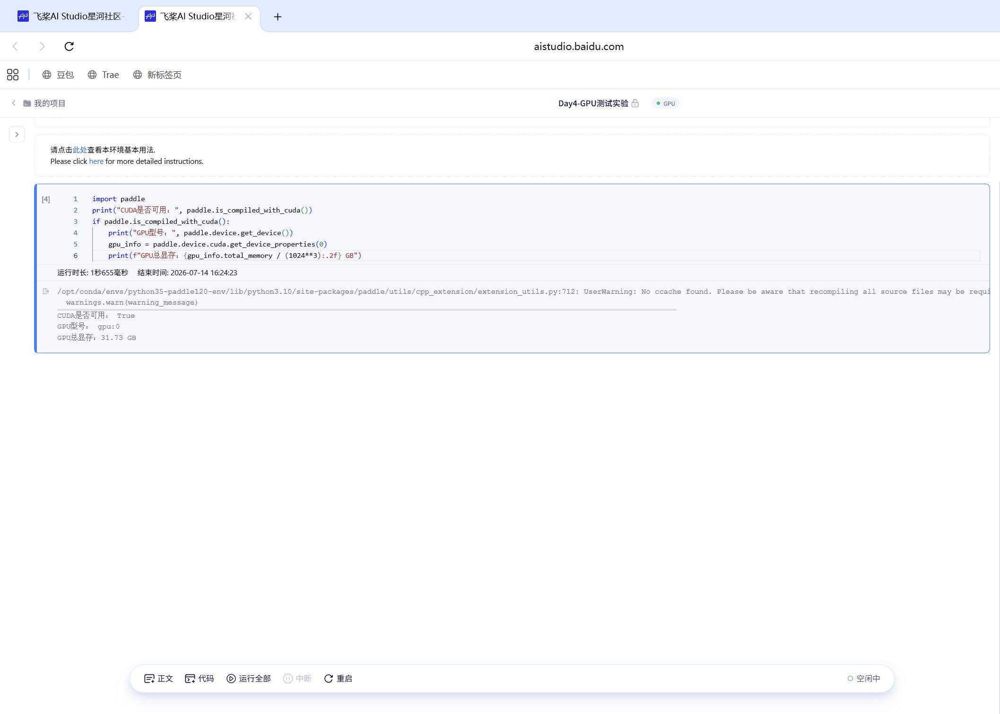
## Python 检测源码
```python
import paddle
# 检测当前GPU硬件信息，对标Colab打印显卡需求
print("CUDA是否可用：", paddle.is_compiled_with_cuda())
if paddle.is_compiled_with_cuda():
    print("GPU型号：", paddle.device.get_device())
    gpu_info = paddle.device.cuda.get_device_properties(0)
    print(f"GPU总显存：{gpu_info.total_memory / (1024**3):.2f} GB")
```

## 遇到问题
创建项目后默认启动 CPU 环境，找不到 GPU 切换入口，无法调用显卡算力。
最初使用 torch 检测代码执行时报错：Cannot run import torch because of system compatibility，平台预装 Paddle，未自带 PyTorch 库。
## 解决方法
切换 GPU 入口在 Notebook 页面右上角 CPU 标识按钮，点击即可弹出算力切换面板；仅 BML Codelab 版本支持 GPU，AI Studio 经典版仅能使用 CPU。
放弃 PyTorch 代码，使用平台原生 Paddle 框架编写 GPU 检测代码，无需额外安装依赖，直接运行。

# 第5天：注册1个免费LLM API（智谱清言）
## 实训目标
成功注册并获取API Key（本地妥善保存，不要公开）。

## 操作过程
1. 访问智谱AI开放平台官网：https://open.bigmodel.cn/，使用手机号注册账号并完成实名认证。
2. 进入开发者控制台创建应用，复制生成的API Key，本地单独保存。
3. 激活py310虚拟环境，使用pip安装智谱官方zhipuai SDK：
```bash
pip install zhipuai
```
4. 新建 Python 脚本，填入本地保存的 API Key，执行代码完成连通测试，成功接收大模型返回文本。

## 运行截图
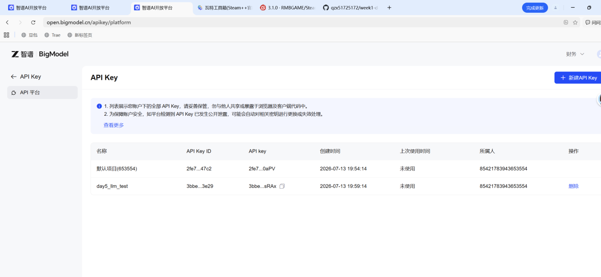
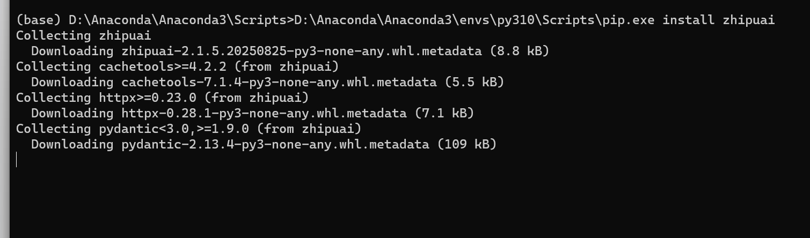
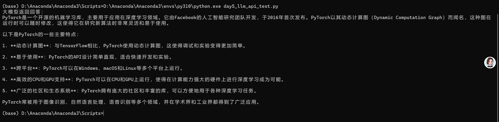
## Python调用源码（文件路径 ./day5_llm_api_test.py）
```python
from zhipuai import ZhipuAI

# 填入你本地保存的完整API Key，禁止明文上传公开仓库
client = ZhipuAI(api_key="在此填写个人API密钥")

response = client.chat.completions.create(
    model="glm-4-flash",
    messages=[{"role": "user", "content": "简单介绍PyTorch是什么"}]
)
print("大模型返回回答：")
print(response.choices[0].message.content)
```
## 遇到问题
1. 在普通 CMD 窗口仅手动加载 base 基础环境，缺少 shell 初始化配置，无法正常调用 py310 环境；
2. 执行代码时报错：ModuleNotFoundError: No module named'sniffio'，安装 zhipuai 时依赖包缺失。
## 解决方法
不手动切换环境，直接指定 py310 虚拟环境内的 pip 程序安装依赖：
D:\Anaconda\Anaconda3\envs\py310\Scripts\pip.exe install zhipuai
单独补全缺失的 sniffio 依赖模块：
D:\Anaconda\Anaconda3\envs\py310\Scripts\pip.exe install sniffio

# 第 6 天：复习 Python：文件读写 / JSON / pandas
## 实训目标
能写出一个脚本，完成简单的数据读写与打印统计结果。
## 操作过程
1. Excel 导出「CSV UTF-8（逗号分隔）」文件，存放至week1-data-project目录。
2. 新建day6_csv_json_pandas.py，导入 pandas、json 库，使用相对路径读取 CSV，指定 utf-8 编码。
3. 通过to_dict("records")将表格转为字典列表，使用open()手动写入 JSON，配置ensure_ascii=False保留中文。
4. 终端初始路径不匹配，触发文件不存在报错；执行cd git-test\week1-data-project切换目录后重跑代码。
5. 控制台输出转换完成，文件夹生成output.json，中文显示正常。

## 运行截图
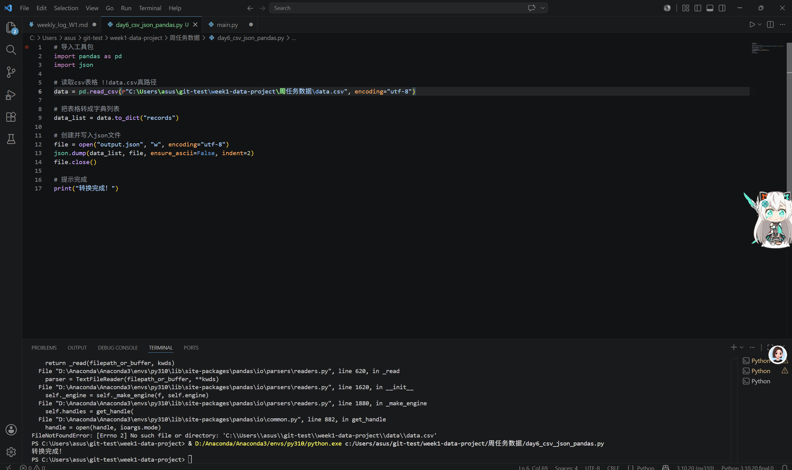
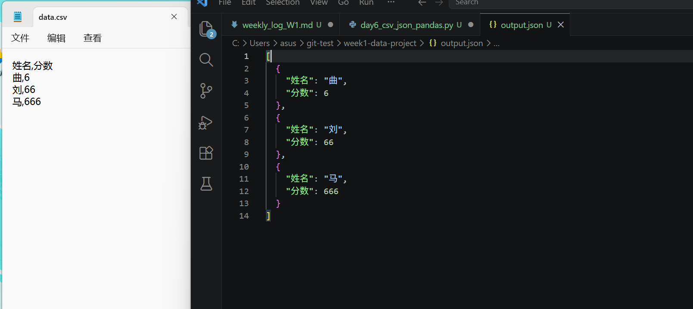

## 遇到问题
普通导出的 CSV 为 Excel 二进制碎片，打开全是乱码，无法正常解析；
旧文件存在脏字符，读取时报编码错误、行列解析不匹配；
相对路径受终端位置影响，JSON 生成位置错乱，找不到文件；
脏数据读取后，终端、导出文本均出现中文乱码。
## 解决方法
删除损坏文件，WPS 另存为专用 UTF-8 编码 CSV，生成标准纯文本表格；
读取时强制声明encoding="utf-8"，统一编码避免兼容报错；
读写可使用绝对路径，固定文件生成位置，防止路径错乱；
仅保留 CSV 转 JSON 核心逻辑，规避终端编码导致的乱码。