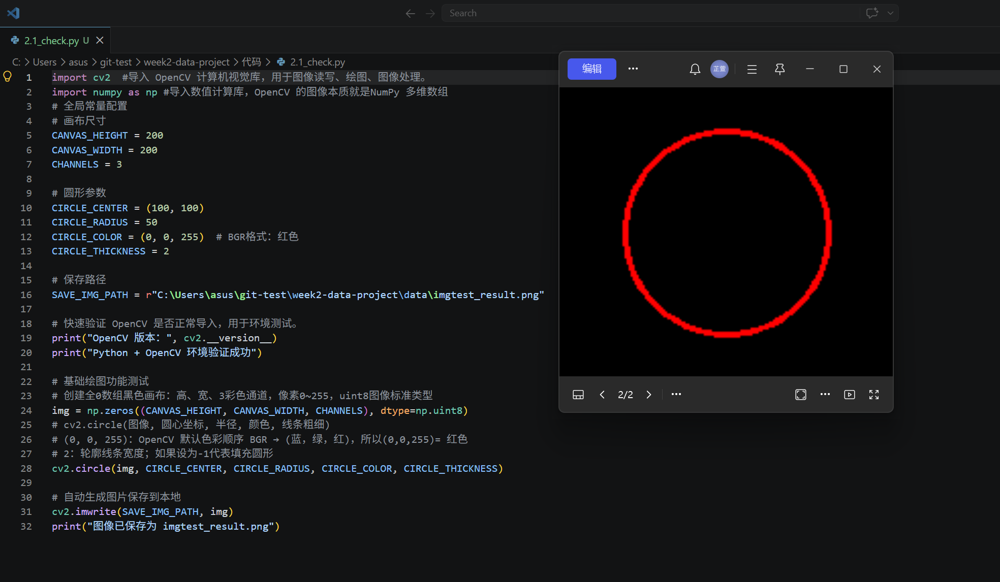
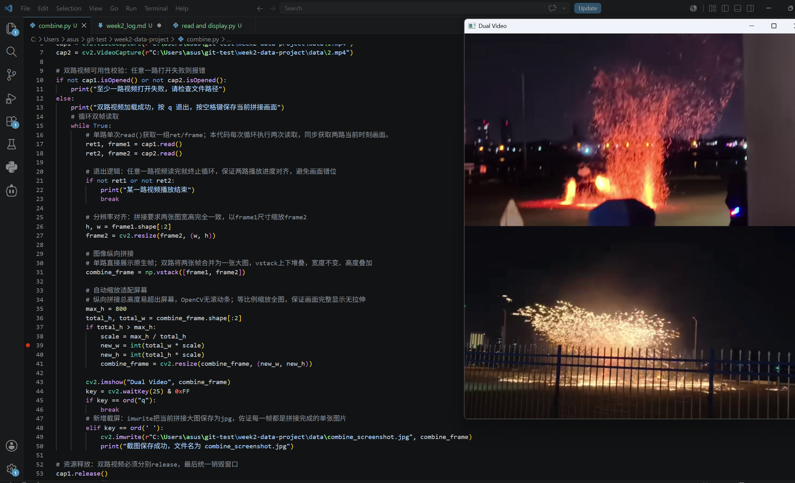
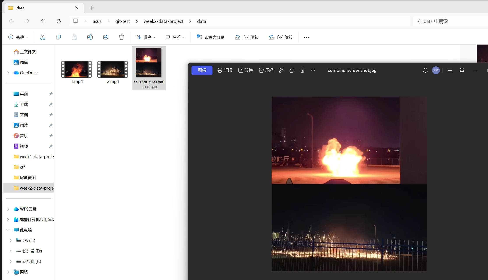
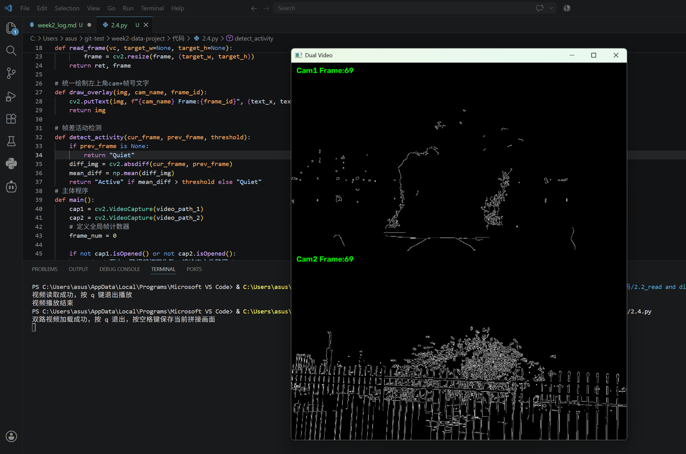
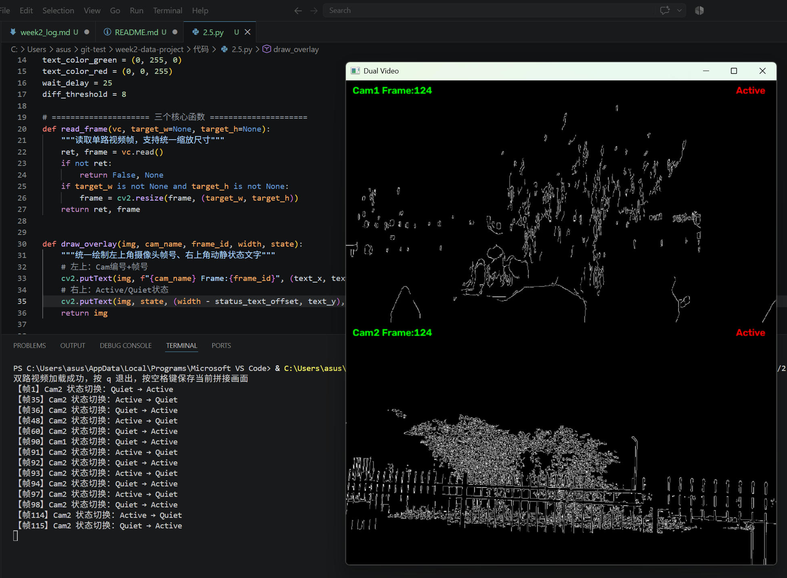

# 第二周日志

## 2.1环境确认：
确定本机中可以使用Python+OpenCV；本地准备两段短视频文件，放到data/目录中。

## 运行内容
测试：创建200×200三通道黑色画布，利用cv2绘制红色空心圆形，将生成图片保存至data文件夹；控制台打印OpenCV版本号，校验库导入、绘图、图像保存全部功能。
附带运行截图：


## 问题
1. pip 从国外官方源下载 opencv-python 时网络超时，国内直连PyPI官网网速差、连接中断
使用国内清华镜像源安装
```bash
pip install opencv-python -i https://pypi.tuna.tsinghua.edu.cn/simple
```
2.  路径反斜杠被Python转义报错，使用r原始字符串解决

## 2.2单路视频读取与显示
先写一个简单脚本：读取一个视频源；逐帧显示；按 q 退出。确认 OpenCV 基本流程没问题。
## 运行内容
1. 集中定义全局参数
2. 封装read_frame通用函数，统一实现视频帧读取，返回帧状态与图像数组，方便后续复用；
3. 全部业务代码封装至main函数，搭配标准程序入口，防止文件被导入自动运行；
4. 调用VideoCapture打开本地视频，使用cap.isOpened校验视频能否正常读取；打开失败主动释放资源、关闭窗口并提示；
5. while循环持续调用read_frame取帧，读取完毕终止循环；使用imshow展示画面，配合waitKey刷新窗口；
6. 程序收尾统一执行release释放视频流、destroyAllWindows关闭所有窗口。

运行程序后，弹出视频播放窗口，视频正常逐帧播放；
鼠标点击视频窗口，按下键盘q（选中 OpenCV 弹出的视频窗口，再按下按键），程序正常终止；视频播放完毕程序自动结束。

## 可能的问题
窗口黑屏，看不到视频画面
原因：调用cv2.imshow()之后没有搭配cv2.waitKey()，窗口无法刷新图像。
解决：代码中必须保留cv2.waitKey()。

## 2.3扩展为双路视频显示
同时打开两个 VideoCapture；每一帧分别读取两路图像；将两张图像通过 hstack 或 vstack 拼接成单张图后显示。

## 思路
### F1：延续2.2 集中置顶全部可配置常量，统一管理所有外部路径与播放参数.
### F2：迭代read_frame
1. 原：帧读取，返回读取状态与图像；
2. 增：read_frame新增宽、高入参，读取帧时直接完成缩放；函数复用。
### F3：双视频初始化与合法性校验
1. 单路仅创建1个VideoCapture，本代码并行创建两组视频读取对象；
2. 双路视频可用性校验：任意一路视频打开失败，即刻释放全部资源并终止程序，避免进程残留。
### F4：循环同步读帧与分辨率对齐
1. 以 Cam1 画面尺寸为基准，Cam2 借助函数缩放适配尺
2. 任意一路视频读取完毕(ret=False)则整体结束循环，保障两路播放时序同步。
### F5：画面纵向拼接 + 整体自适应缩放
1. 使用np.vstack上下拼接两路画面；
2. 拼接总高度超出预设上限时整体等比例缩小，适配显示器窗口。
### F6：按键交互
依靠waitKey捕获键盘输入，完成功能：
    保留 q 键退出
    增：空格键调用imwrite保存当前拼接画面截图至./data/。
附带运行截图：



## 问题
1. 纵向拼接后整体画面过高超出屏幕，OpenCV窗口不支持滚动
增加全局最大高度限制，画面超限自动等比例缩放。
2. 两路视频原始分辨率不同，直接拼接代码报错
使用resize统一两张画面宽高，满足拼接维度要求。

## 2.4添加图像处理与文字叠加
对每一路的图像先做灰度化或边缘检测；
使用cv2.putText在每个画面对应位置叠加“Cam1/Cam2 + 帧号”等信息。

## 运行内容（仅本次新增功能）
### F1：补充图像处理相关全局配置
### F2：封装draw_overlay绘图函数
仅需传入图像、摄像头名称、帧号，即可自动完成左上角文字渲染，消除重复代码，改一处即可。
### F3：标准化边缘检测流程
原图灰度化————Canny边缘提取————灰度图转回BGR三通道，支持两路画面拼接。
### F4：增加帧计数+文字标注
定义frame_num记录当前播放到第几帧，逐帧调用绘图函数，给两路画面标注Cam编号+当前帧数。
附带运行截图：

两路画面均展示黑白边缘轮廓，左上角:(绿)摄像头+帧序号

## 问题
1. Canny输出单通道图像，通道数不一致，拼接代码报错
用cvtColor把单通道轮廓图转为三通道图像，匹配拼接要求。
2. 两路画面分别写putText，文字样式需要重复修改
把绘制逻辑封装成独立函数，一处修改即可全局同步生效。

## 2.5帧差运动检测与状态可视化
## 任务目标：
在2.4基础上，新增帧差法动静检测，实现画面状态标注、状态切换日志打印。
## 运行内容（仅新增功能）
### F1：补充运动检测配套全局参数
### F2：draw_overlay绘图函数的plus
原：左上角摄像头编号+帧号（绿）
增：右上角文字绘制（红）函数入参新增画面宽度、运动状态，实现一函数同时完成两处文字绘制。
### F3：detect_activity 帧差检测优化
对前后灰度帧做像素差分，用像素均值结合阈值区分Active/Quiet
增加前置帧判断，首帧无历史图像直接判定静止，规避空值运算报错。
### F4：增设缓存变量
初始化prev_frame1、prev_frame2缓存两路历史帧
state1_old、state2_old 缓存上一轮运动状态，用于帧差计算与状态变更识别。
### F5：帧级检测与状态日志输出
循环内分别完成双路画面动静检测
比对，发生状态切换则控制台打印帧号+摄像头标识+状态变化信息，便于回溯动静节点。
### F6：画面可视化与缓存更新
将Active/Quiet状态传入绘图函数，右上角红字实时标注动静
循环末尾刷新历史帧与旧状态，保障下一帧正常比对。
附带运行截图：

运行效果：边缘轮廓、左上帧号正常展示；右上角实时标注动静，状态切换自动打印日志，历史所有功能均可正常使用。
## 问题
1. 最开始没有缓存上一帧，无法做前后像素对比，帧差逻辑无法运行
解决：新增变量专门存储两路画面的上一帧图像，每次循环结尾更新缓存帧。
2. 只标注状态，但不知道什么时候画面动静发生改变，不方便定位时间节点
解决：缓存上一轮状态，新旧状态不一致时主动打印日志，精准记录状态切换对应的帧数。